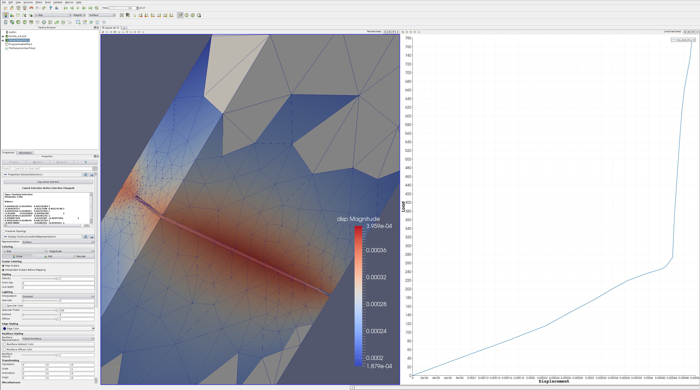

# pvloadvsdisplacement
Python code for a Paraview programmable filter that supports plotting the maximum load vs the maximum displacement over time for a set of user selected elements. 

Tested in Paraview 4.3.1 on GNU/Linux.

# How to use
* Open a pvtu file
* select some elements via 'select elements through'
* Filters->Alphabetical->Extract Selection 
* Click apply
* Filters->Alphabetical->Programmable Filter
* Paste loadVsDisp.4.3.py into the 'Script' text box
* Set 'Output Data Set Type' to 'vtkTable'
* Click apply
* Click the row in the spreadsheet window - it should become shaded
* Filters->Alphabetical->Plot Selection Over Time
* Click apply
* Under 'X Axis Parameters' set 'X Array Name' to 'max_disp'
* Under 'Series Parameters' select only the 'max_stress' box
* The plot title and axis labels can be set as needed via the other filter properties 
